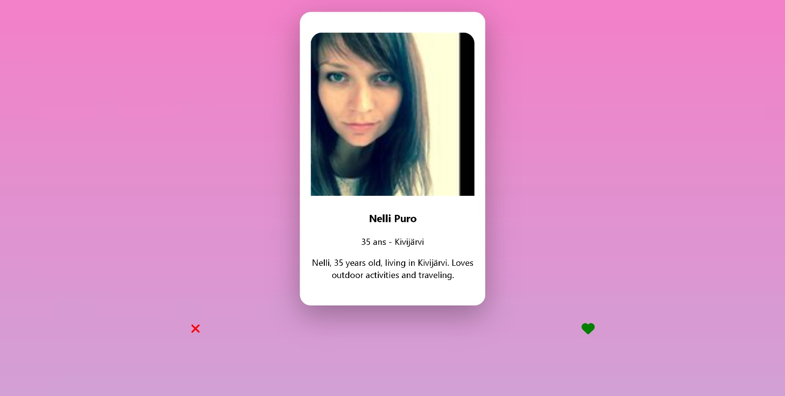

# TP_FINAL_TINDER

Pour lancer notre projet, il faut avoir préalablement installé Node.js (voir Readme dans le dossier "app"). De plus, il faut installer les dépendances nécessaires dans le dossier "API" (idéalement dans un environnement virtuel) à l'aide de la commande :
```
pip install -r requirements.txt
```


